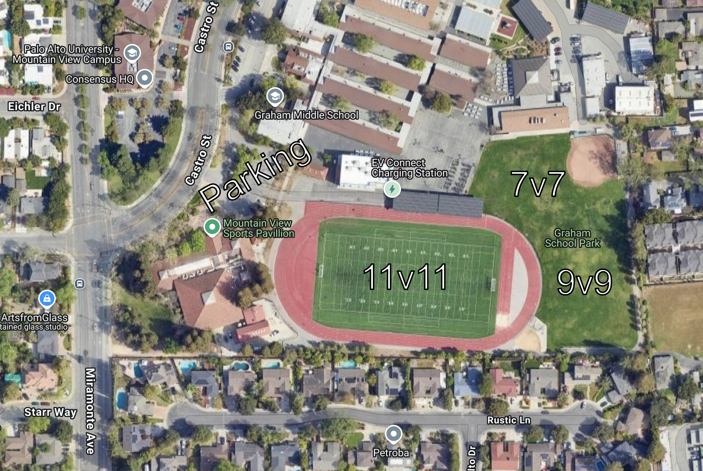
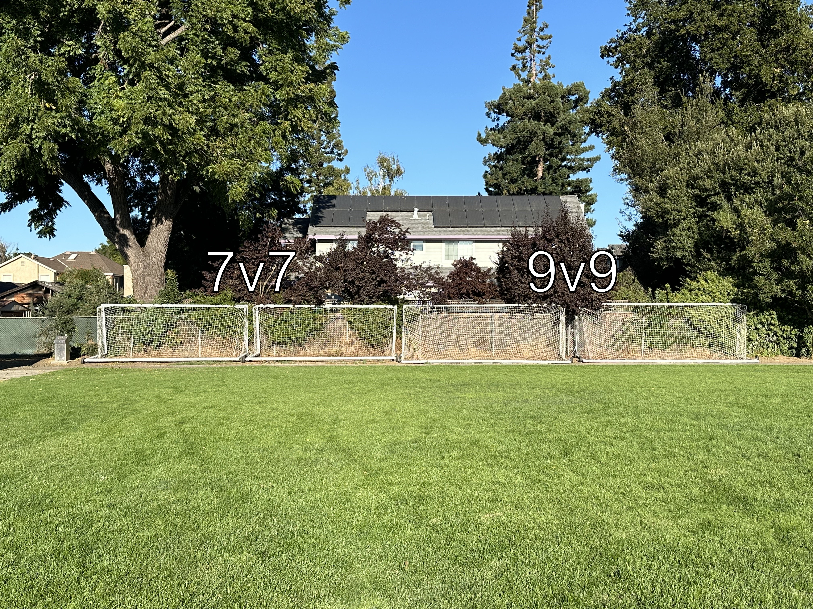

# Graham Middle School
<https://graham.mvwsd.org/>  
[1175 Castro St, Mountain View, CA 94040](https://maps.app.goo.gl/NUfZqrafMejR5ZiM6)

**Access Restrictions**

> [!IMPORTANT]
> Graham Middle School is a closed campus during school hours Monday through Friday from 7:30 AM and 4:00 PM and between sunset and sunrise, and has automatic locking gates.

Please visit <https://mvlasc.org/fields/> to review the Field Rules and Procedures Manual, Good Neighbor Policy, or to report a field or equipment issue.

For urgent access or other field or equipment issues, check the Field Combo Code Information document in the Club Library section of Byga through the mobile app or at <https://mvlasc.byga.net> for updated combinations and MVLA Field Coordinator contact information.

- [Grass Small 7v7 Field](https://github.com/kennyspade/mvlasc/edit/main/README.md#graham-middle-school-grass-small-7v7-field)
- [Grass Big 9v9 Field](https://github.com/kennyspade/mvlasc/edit/main/README.md#graham-middle-school-grass-big-9v9-field)
- [Grass Turf Field](https://github.com/kennyspade/mvlasc/edit/main/README.md#graham-middle-school-turf-field)

## Graham Middle School Grass Small 7v7 Field

For your team's upcoming game at Graham Middle School Grass Small 7v7 Field, here are the rules that we need your help enforcing as well as the setup and cleanup procedures that need to be adhered to if your team has one or both of these duties.

**Rules for Graham Middle School Grass Small 7v7 Field**

> [!IMPORTANT]
> (Please send to visiting manager)

- Please stay off of the turf field and the track - no food, drinks or dogs are allowed on either - there is direct access to the grass fields via the blacktop between the track and the school

**Setup**

Equipment for this field is stored in a section labeled Graham Grass Small 7v7 in Unit B on the opposite side of the concession / bathroom building. The key is located in a key lock box located on the fence next to the building. Note that there are 2 lock boxes. MVLA’s lock box is the large Igloohome lock box on the left side of the fence. Type in the code and press the **unlock** button, wait for the light to flash green, then pull the front of the box open. Return the key IMMEDIATELY to the key lock box after opening the door and propping it open before retrieving ANY equipment. DO NOT place it in your pocket and forget to return it.

- The 7v7 goals are located closest to the softball field.
- 4 Corner Flags and 2 goal weight sandbags (1 per goal) are retrieved from the Small 7v7 labeled section of the Graham storage unit as per the above instructions.
- No other equipment should be taken from this storage unit.

**Cleanup**

  
7v7 and 9v9 Goals

  
  

- Leave the nets on the goals, pivot the wheels to the down position, and roll the goals back to the east fence closest to the softball field with the goal mouth facing the fence. Position the goals such that the one chain can lock both goals.
- Return the flags (4) and goal weights (2) to the Graham Storage Unit using the "Setup" directions above and ensure they are placed in the area marked for Graham Grass Small (7v7).
- Please leave the field cleaner than when you arrived.

## Graham Middle School Grass Big 9v9 Field

**Rules for Graham Middle School Grass Big 9v9 Field**

> [!IMPORTANT]
> (Please send to visiting manager)

- Please stay off of the turf field and the track - no food, drinks or dogs are allowed on either - there is direct access to the grass fields via the blacktop between the track and the school

**Setup**

Equipment for this field is stored in a section labeled Small 7v7 in Unit B on the opposite side of the concession/bathroom building. The key is located in a key lock box located on the fence next to the building. Note that there are 2 lock boxes. MVLA’s lock box is the large Igloohome lock box on the left side of the fence. Type in the code and press the **unlock** button, wait for the light to flash green, then pull the front of the box open. Return the key IMMEDIATELY to the key lock box after opening the door and propping it open before retrieving ANY equipment. DO NOT place it in your pocket and forget to return it.

- 4 Corner Flags and 2 goal weight sandbags (1 per goal) are retrieved from the section labeled Graham Grass Big 9v9 in the Graham storage unit as per the above instructions.
- **Pre-NPL teams will need to retrieve two of the MVLA canopies labeled Graham Pre-NPL and two sets of four canopy sandbag weights**
- No other equipment should be taken from this storage unit.
- The 9v9 (7’ x 21’) goals are located on the east fence of the grass field 25 yards south of the baseball dirt infield. Note that there are two locks connected in sequence so that either lock can release the goals. When you lock up the goals, make sure you lock them in such a way that either lock can still release the goals.
- Roll the goals to the field, swivel the wheels to the up position and place a goal anchor weight on the back of each goal.

**Cleanup**

- Leave the nets on the goals, pivot the wheels to the down position, and roll the goals back to the east fence approximately 25 yards south of the dirt infield with the goal mouth facing the fence. Position the goals such that the one chain can lock both goals.
- Note that there are two locks connected in sequence so that either lock can release the goals. When you lock up the goals, make sure you lock them in such a way that either lock can still release the goals.
- Please return the goal anchor weights (2) and flags (4) to the Graham Storage Unit using the "Setup" directions above and ensure they are placed in the area marked for Graham Grass 9v9.
- **If your game is a Pre-NPL game, please return the canopies and benches as well.**
- Please leave the field cleaner than when you arrived.

## Graham Middle School Turf Field
For your team's upcoming game at Graham Middle School Turf Field, here is the schedule for the day and the rules that we need your help enforcing as well as the setup and cleanup procedures that need to be adhered to if your team has one or both of these duties.

**Rules for Graham Middle School Turf Field**

> [!IMPORTANT]
> (Please send to visiting manager)

- No dogs allowed on the turf or the track
- No gum allowed on the turf or the track
- No food allowed on the turf or the track - snacks can be consumed behind the track in the dirt area near the fence
- No drinks other than water allowed on the turf or the track
- Teams are to sit on the south touchline
- Parents and spectators are to sit outside the fence in the low bleachers on the side closest to the school.
- Do not allow anyone to place chairs on the turf or the track

**Setup**

Equipment for this field is stored in a section labeled Small 7v7 in Unit B on the opposite side of the concession/bathroom building. The key is located in a key lock box located on the fence next to the building. Note that there are 2 lock boxes. MVLA’s lock box is the large Igloohome lock box on the left side of the fence. Type in the code and press the **unlock** button, wait for the light to flash green, then pull the front of the box open. Return the key IMMEDIATELY to the key lock box after opening the door and propping it open before retrieving ANY equipment. DO NOT place it in your pocket and forget to return it.

- Goals should already be on the field and are to remain on the field.
- Corner flags (4) and bases (4) are retrieved from the Graham Storage Unit located on the back side of the concession/restroom building - Unit B, far left corner under the sign for Graham Turf.

**Additional Requirements for ECNL / NPL / ECNL-RL Games**

ECNL and NPL / ENCL-RL games have additional requirements as outlined in the NorCal Handbooks. MVLA provides equipment to meet these requirements, and it is up to your team to arrange for a volunteer or volunteers to pick up this equipment on the day of your game or coordinate with other teams for a handoff between games. Because this equipment is shared between teams, you must only pick up the equipment allocated to your team on the dates designated to avoid conflicts.

Please note that for ECNL games, teams must provide their own ice and water for every game. This will often end up with extra bottles of water left over at the end of the day. Feel free to leave these in the storage unit at Graham Middle School or offer them to anyone at the game who would like to take them home, but do not leave them at the field.

Equipment for this field is stored on site in Unit B on the opposite side of the concession/bathroom building. The key is located in a key lock box located on the fence next to the building. Note that there are 2 lock boxes. MVLA’s lock box is the large Igloohome lock box on the left side of the fence. Type in the code and press the unlock button, wait for the light to flash green, then pull the front of the box open. Return the key ⚠️IMMEDIATELY⚠️ to the key lock box after opening the door and propping it open before retrieving ANY equipment. DO NOT place it in your pocket and forget to return it.

- ECNL
  - [ ] 3 canopies
  - [ ] 3 sets of 4 canopy sand bag weights (total of 12)
  - [ ] 1 table
  - [ ] Benches are provided at the soccer field and do not need to be transported
  - [ ] 2 orange Gatorade branded 10-gallon water jugs
  - [ ] 2 gallons of filtered / bottled water
  - [ ] 1 small bag of ice, up to 10 pounds
  - [ ] Roll of small plastic bags for ice for trainer
- NPL / ECNL-RL
  - [ ] 2 canopies
  - [ ] 2 sets of 4 canopy sand bag weights (total of 8)
  - [ ] Benches are provided at the soccer field and do not need to be transported

**Cleanup**

- When your game is over, goals are to REMAIN on the field. Do not move them to the fence area.
- Return the flags and flag bases to the Graham Storage Unit under the sign labeled Graham Turf using the "Setup" directions above.
- If NPL or ECNL, return the canopies and weights to Graham Storage Unit B.
- If ECNL, please return the Ice Cooler & Water Jug.
- Please leave the field cleaner than when you arrived.
